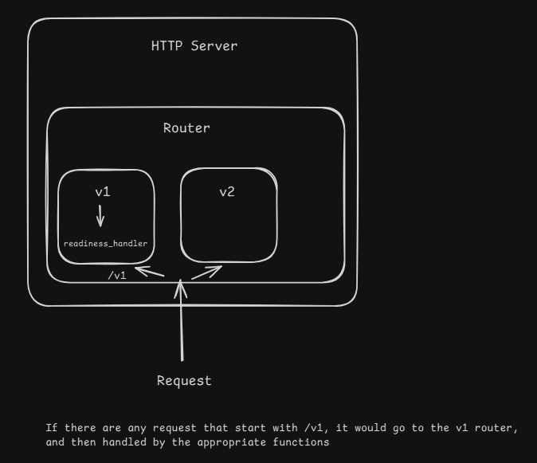

# RSS_aggregator_go
RSS Aggregator in Go


### Packages used
```
go get github.com/joho/godotenv (try tidy then vendor)

go get github.com/go-chi/chi 

go get github.com/go-chi/cors

go install github.com/sqlc-dev/sqlc/cmd/sqlc@latest // postgres interaction

go install github.com/pressly/goose/v3/cmd/goose@latest // help with sql migrations 
```

### Created Artifacts 
1. `go.sum` # Contains checksums of downloaded modules for verification 

2. `vendor/`  # store copies of project's dependencies locally within project


